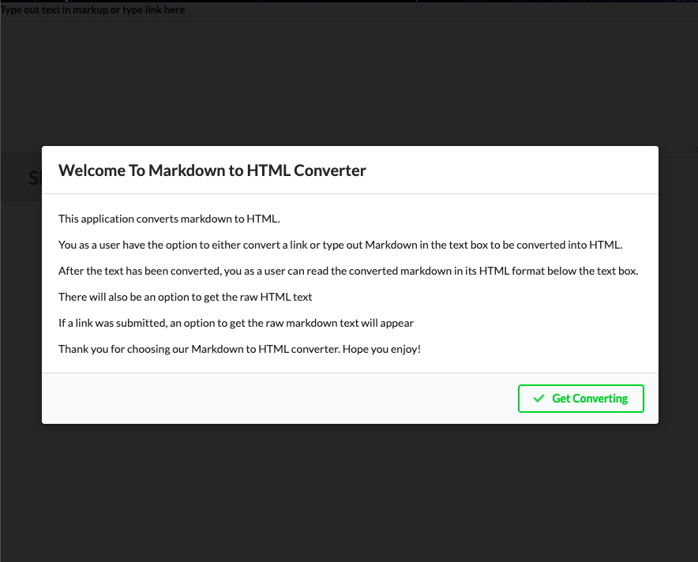
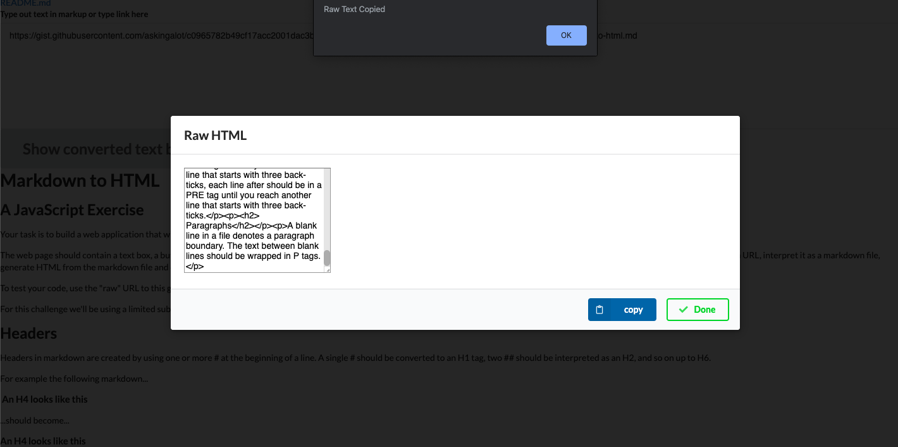
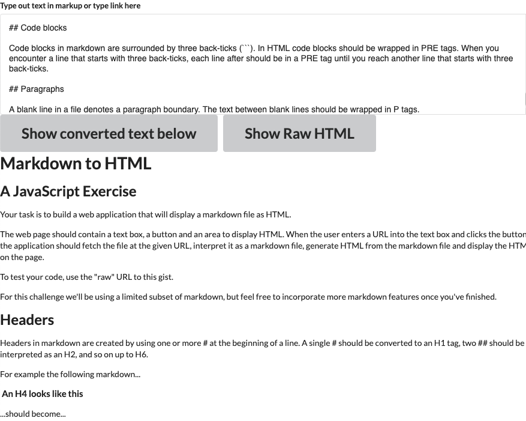
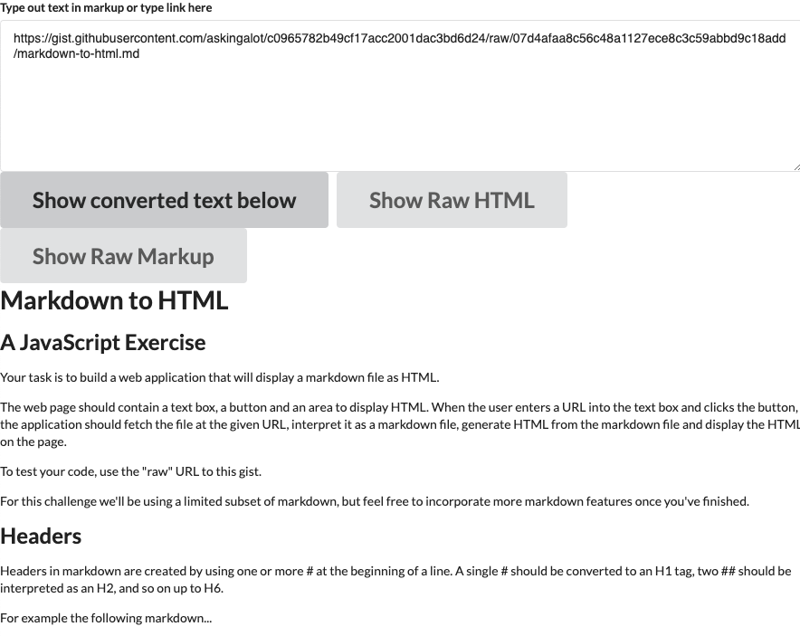
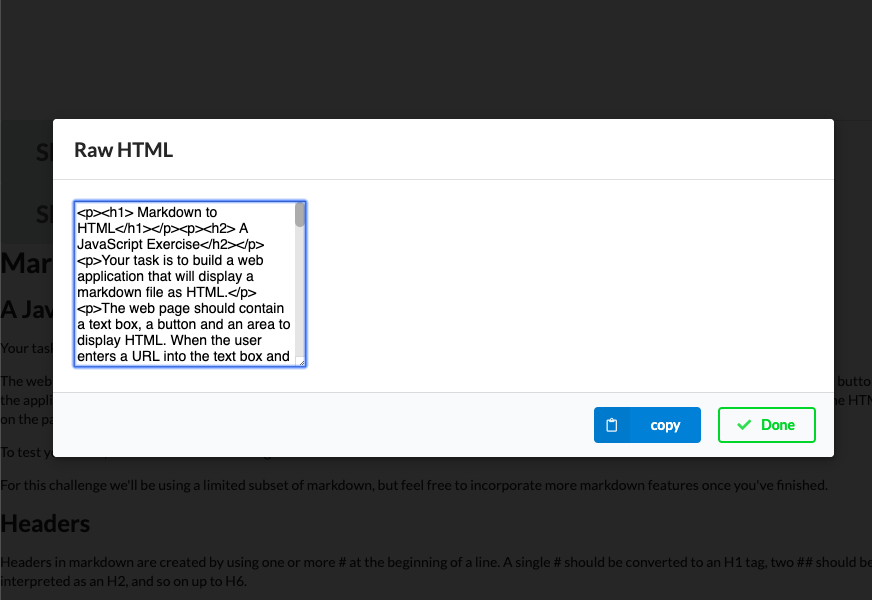
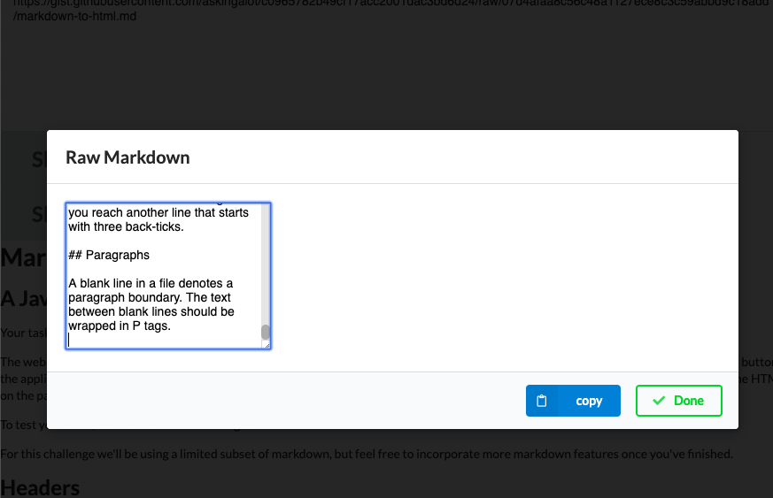

# Markdown Converter

Created: 02/07/20 | Modified: 02-08-2020 11:23:09

*This assignment is a code challenge: [Directions](directions.md)*

Preview assignment here: https://trinity-md-to-html-converter.netlify.com/
***

*Welcome Message*

## Description
- This application is a Markdown to HTML Converter

## Features
- The User has the option to either convert a link or type out Markdown in the text box to be converted into HTML.

- After the text has been converted, the user can read the converted markdown in its HTML format below the text box.

- There will also be an option to get the raw HTML text

- If a link was submitted, an option to get the raw markdown text will appear

- User can click copy button on raw text modal to copy raw text to the clipboard
***

*Copying to Clipboard*

*** 

*Markup Text Input*

***

*Markup URL Input*

***

*Raw HTML Modal*

***

*Raw MD Modal*